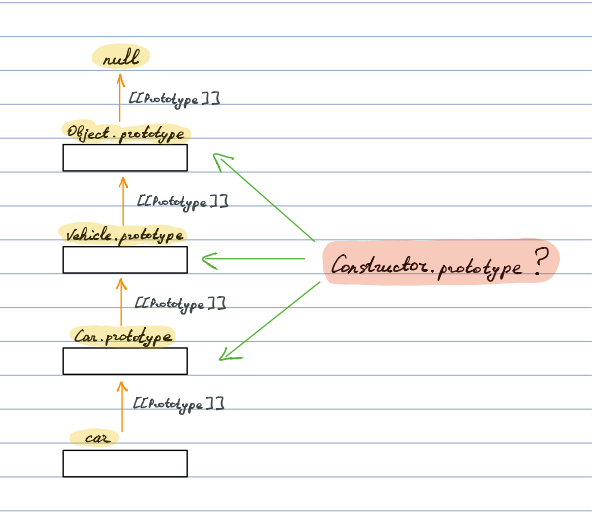

# JavaScript Interview Questions

## Theory Section

### How does the "this" keyword work?

- First step is to find the place where the function was called.
- Second step is to check questions from top to the bottom and stop if the rule is applied.

1. Is a function called with `new`?

   **Answer**: `this` is a newly constructed object

   ```javascript
   function Person(name) {
     this.name = name;
   }

   const person = new Person("John");
   console.log(person.name); // John
   ```

2. Is `call`, `apply` or `bind` was used to call the function?

   **Answer**: `this` is a specified `thisArg` parameter

   ```javascript
   function getName() {
     return this.name;
   }

   const person = {
     name: "John"
   };

   console.log(getName.call(person)); // John
   console.log(getName.apply(person)); // John

   const boundGetName = getName.bind(person);

   console.log(boundGetName()); // John
   ```

3. Is a function called with context object.

   **Answer**: `this` is a context object

   ```javascript
   function getName() {
     return this.name;
   }

   const person = {
     name: "John",
     getName
   };

   // "this" = person (context object) for the `getName` function
   console.log(person.getName()); // John
   ```

4. Default case:

   **Answer in `strict mode`**: `this` is an `undefined`

   ```javascript
   var name = "globalName";

   function getName() {
     "use strict";
     return this.name;
   }

   console.log(getName()); // TypeError: Cannot read property 'name' of undefined
   ```

   **Answer in non-`strict mode`**: `this` is a global object

   ```javascript
   var name = "globalName";

   function getName() {
     return this.name;
   }

   console.log(getName()); // globalName
   ```

**Note**:

Arrow function doesn't have own `this`. It takes it from the outside. More about arrow functions [link to the question about an arrow function]

---

### What is an arrow function?

**Syntax**:

```javascript
// arrow function
const sum = (a, b) => a + b;

// regular function
function sum(a, b) {
  return a + b;
}
```

- No `this`

The `this` value of the enclosing lexical scope is used.

It's better not to use an arrow function as a method.

```javascript
const company = {
  name: "Awesome",
  employees: ["John", "Mike", "Joe"],

  printEmployees() {
    this.employees.forEach(employee => {
      // "this" = company, is taken from the outside
      console.log(`${this.name}: ${employee}`);
    });
  }
};

company.printEmployees();

// Output:
// Awesome: John
// Awesome: Mike
// Awesome: Joe
```

- No `arguments`

Takes it from the enclosing scope.

Not a big deal as rest parameters could be used alternatively.

```javascript
function sum() {
  // "arguments" of the enclosing scope
  const helper = () => arguments[0] + arguments[1];
  return helper();
}

console.log(sum(2, 3)); // 5
```

- No `super`

Takes it from the enclosing scope.

```javascript
class Vehicle {
  start() {
    console.log("Vehicle: start");
  }
}

class Car extends Vehicle {
  start() {
    console.log("Insert and turn the key");

    const helper = () => {
      // takes "super" from the outer function
      super.start();
      console.log("Car: started");
    };

    helper();
  }
}

const car = new Car();
car.start();

// Output:
// Insert and turn the key
// Vehicle: start
// Car: started
```

- Can't be used with `new`

```javascript
const Foo = () => {};
const foo = new Foo(); // TypeError: Foo is not a constructor
```

- No `prototype` property

```javascript
const Person = () => {};
console.log(Person.prototype); // undefined
```

---

### What is a "hoisting"?

Variable and function declarations are processed before any part your code is executed.

That statement has actually two parts:

```javascript
var name = "John";
```

- `var name` - declaration, processed during the compilation phase
- `a = "John"` - assignment, processed during execution phase

**Example**:

```javascript
// hoisting: function could be called before declaration
getName();

function getName() {
  // hoisting: could be used before variable declaration
  console.log(name); // undefined

  var name = "John";
}
```

**Note**:

- hoisting works only per-scope
- function expressions are not hoisted
- functions are hoisted before variables

---

### What built-in types does JavaScript have?

- `null`
- `undefined`
- `boolean`
- `number`
- `string`
- `object`
- `symbol` (added in ES6)

All types are primitives except an `object`

---

### What are the rest parameters and spread operators?

#### Rest Parameter

Rest parameter allows us to collect indefinite number of arguments.

```javascript
function sum(...args) {
  // args is an array of parameters
  return args.reduce((previous, current) => previous + current);
}

console.log(sum(1, 2, 3, 4, 5)); // 15
```

rest parameters vs "arguments"

- "arguments" is not a real array. `sort`, `filter`, `reduce`, `map` and other array functions couldn't be used with it. Rest parameter is an `Array` instance.
- Arrow functions don't have "arguments". Rest parameters should be used for them.
- "arguments" object contains all arguments passed to the function, while the rest parameter contains only the remaining part without parameters with separate names

**Note**:

The rest parameter have to be the last argument in the function.

#### Spread Operator

Allows an iterable (array, string, etc) to be expanded in the next places.

```javascript
// function call
fn(...iterableObj);

// array
[...iterableObj, 1, 2];

// object literal
const clonedObj = { ...obj };
```

`fn.apply(null, args)` is the same as `fn(...args)`

---

### What are the "call" and "apply" functions? "call" vs "apply"?

These methods are used to call a function with a given `this` and arguments.

"call" vs "apply":

- `call()` accepts an argument list, while `apply()` accepts an array of arguments

```javascript
function getInfo(age, position) {
  return `${this.name}, ${age}, ${position}`;
}

const person = { name: "John" };

getInfo.call(person, 34, "JS Developer"); // John, 34, JS Developer
getInfo.apply(person, [34, "JS Developer"]); // John, 34, JS Developer
```

---

### What is an "instanceof" operator? How does it work?

`obj instanceof constructor` checks whether `constructor.prototype` equals to one of the prototypes in the `obj` prototype chain.

```javascript
class Vehicle {}
class Car extends Vehicle {}

const car = new Car();

car instanceof Car; // true
car instanceof Vehicle; // true
car instanceof Object; // true

// under the hood
car.__proto__ === Car.prototype; // true
car.__proto__.__proto__ === Vehicle.prototype; // true
car.__proto__.__proto__.__proto__ === Object.prototype; // true
```



**Note**:

`instanceof` behavior could be customized by adding `static` `Symbol.hasInstance` method.

```javascript
class Person {
  static [Symbol.hasInstance](value) {
    if ("name" in value && "age" in value) {
      return true;
    }

    return false;
  }
}

console.log({ name: "John", age: "29" } instanceof Person); // true
```

---

### What is a closure?

A **closure** is a function that remembers its outer variables and can access them.

```javascript
function createCounter() {
  let count = 0;
  return function() {
    // takes `count` from the outer lexical environment
    return count++;
  };
}

let firstCounter = createCounter();
let secondCounter = createCounter();

console.log(firstCounter()); // 0
console.log(firstCounter()); // 1
console.log(firstCounter()); // 2

console.log(secondCounter()); // 0
```

**Lexical Environment**

`Lexical Environment` consists of:

- `Environment Record` (local variables and `this` for the `function environment`)
- reference to an outer `Lexical Environment`

`Lexical Environment` is created for each function call and evaluated code block (`{ ... }`).

To access a variable the inner `Lexical Environment` is searched first, then the outer one and so on until a variable is found or global environment is reached.

All functions have internal property `[[Environment]]` with a reference to the `Lexical Environment` that the function was closed over (creation place).

---

### What is an `IIFE`?

**Immediately Invoked Function Expression** is a function that runs as soon as it is defined.

The variables within `IIFE` can not be accessed from outside and not polluting the global scope.

```javascript
(function() {
  const count = 5;

  console.log(count); // 5
})();

console.log(count); // ReferenceError: count is not defined
```

---

### What is a `bind` function?

The `bind()` method creates a new function that, when called, has its `this` keyword set to the provided value, with a given sequence of arguments preceding any provided when the new function is called.

```javascript
const person = {
  name: "John",
  getName: function() {
    return this.name;
  }
};

const getName = person.getName;
// this = undefined in strict mode or
// this = global object in non-strict mode
console.log(getName()); // undefined

const boundGetName = getName.bind(person);
// this = person
console.log(boundGetName()); // John
```

**Note**:

- Partial Application could be implemented using `bind` function

---

### What is a "partial application"?

The process of fixing a number of arguments to a function, producing another function of smaller arity (number of arguments).

```javascript
function multiply(x, y) {
  return x * y;
}

const double = multiply.bind(null, 2);
const triple = multiply.bind(null, 3);

console.log(double(4)); // 8
console.log(triple(3)); // 9
```

`null` was passed to the `bind` function as `this` argument because we don't use `this` in our `multiply` function. `this` will be equal to:

- `null` in `strict mode`
- global object in non-`strict mode`

**How to apply some arguments without changing `this`?**

```javascript
function partial(fn, ...partialArgs) {
  return function(...args) {
    return fn.call(this, ...partialArgs, ...args);
  };
}

const person = {
  name: "John",
  getInfo(company, year) {
    return `${company}: ${this.name}, ${year}`;
  }
};

person.newGetInfo = partial(person.getInfo, "Awesome");
console.log(person.newGetInfo(2019)); // Awesome: John, 2019
```

Also, `_.partial` and `_.partialRight` functions could be used from the `lodash` library.

---

### What is a "currying"?

**Currying** is the technique of translating the evaluation of a function that takes multiple arguments into evaluating a sequence of functions, each with a single argument.

```javascript
function curry(fn) {
  return function curried(...args) {
    if (args.length >= fn.length) {
      return fn.apply(this, args);
    } else {
      return function(...otherArgs) {
        return curried.call(this, ...args, ...otherArgs);
      };
    }
  };
}

function sum(a, b, c) {
  return a + b + c;
}

const curriedSum = curry(sum);

// currying by definition
console.log(curriedSum(1)(2)(3)); // 6

// additional opportunity to use
console.log(curriedSum(1, 2, 3)); // 6
console.log(curriedSum(1, 2)(3)); // 6
console.log(curriedSum(1)(2, 3)); // 6
```

According to the definition, currying should convert `sum(a, b, c)` to the `sum(a)(b)(c)`.

But most of the time other libraries implement it in a way, that gives an ability to pass multiple arguments at a time as in the example above.

**Partial Application** vs **Currying**:

- partial application can take as many arguments as desired but curried function take one argument at a time

**Note**:

`_.curry` or `_.curryRight` from the `lodash` library could be used to apply **currying** technique.

---

## Practice Section

### What's the output?

```javascript
typeof null;
```

- A: `"null"`
- B: `"object"`
- C: `"undefined"`

<details><summary><b>Answer</b></summary>
<p>

#### Answer: B (`"object"`)

By specification:

```javascript
typeof null === "object"; // true
```

</p>
</details>

---

### What's the output?

```javascript
function Person() {}

const person = new Person();
Person.prototype = {};

console.log(person instanceof Person); // ???
```

- A: `true`
- B: `false`

<details><summary><b>Answer</b></summary>
<p>

#### Answer: B (`false`)

`obj instanceof constructor` checks whether `constructor.prototype` equals to one of the prototypes in the `obj` prototype chain.

The `Person.prototype` was changed after `person` creation, but it doesn't change the `[[Prototype]]` of the created object.

```javascript
person.__proto__ === Person.prototype; // false
```

</p>
</details>

---

### What's the output?

```javascript
const person = {
  name: "John",
  getName: () => {
    return this.name;
  }
};

console.log(person.getName()); // ???
```

- A: `John`
- B: `TypeError`
- C: `undefined`

<details><summary><b>Answer</b></summary>
<p>

#### Answer: C (`undefined`)

Arrow functions have no `this`, so the value of the enclosing lexical scope is used.

It's a global object (`window`) in that case. But the `window` doesn't have `name` property and returns `undefined`.

</p>
</details>

---
